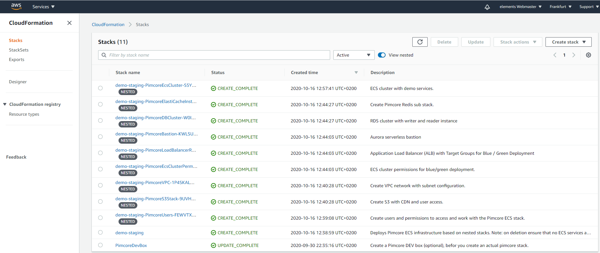

# Pimcore AWS Cloudformation Template

This repository provides a AWS cloud formation (CFN) template with nested stacks to spin up a complete Pimcore application stack in ECS.
An additional CFN template is provided to simplify remote installation of CFN and resources.

Nested Stacks:
 - ``Users`` IAM users for setup and ECS task execution.
 - ``S3 Stack`` S3 bucket and CDN, including access configuration for ECS and the CDN.
 - ``VPC`` VPC configuration with private subnets.
 - ``Load Balancer`` Load Balancer configuration attached to VPC and prepared for deployment scenarios.
 - ``Elastic Cache`` Two Redis instances for caching and session management.
 - ``DB Cluster`` Aurora MySQL DB cluster. Optionally, a read-only DB instance can be activated.
 - ``ECS Cluster`` Farate ECS cluster with App and CLI task definitions, as the boilerplate for installing tasks and services.
 - ``Bastion`` EC2 Bastion Host with SSM Agent installed, for accessing and diagnosing private resources inside the VPC.
 
 ---
 
 
 
 ### Usage
 
 1. Login aws.amazon.com/cloudformation and install the ``pimcoreDevBox`` Cloudformation template. This will give you
 a cloud formation setup user which you can use to install the actual cloudformation stack from your local environment. 
 
 2. Switch to IAM, locate your Setup user and create a new access key in order to retrieve the secret.
 
 3. SSH into your local server, such as ``ssh docker@docker.elements.zone``.
 
 4. Install the AWS CLI or leverage the ecs-cli docker image: ``docker run -it -v ${PWD}:/ecs-cluster  -v /var/run/docker.sock:/var/run/docker.sock agruenwald/ecs-cli bash``
 
 5. Use ``aws configure`` and enter the credentials of the AWS Setup user + dedicated region.
 
 6. Download the Pimcore CFN stack templates and execute cloud formation. git clone <repository-url>. 
 
 7. Execute ``bin/package-cloudformation.sh`` to actually pack, upload and install the cloudformation template. You will need a S3 bucket for your action.
 
 8. After the stack is up and running, you can switch to the [Pimcore AWS Deployer](https://gitlab.elements.at/internal-projects/pimcore-aws-deployer) to start running test images.
 
 ### Common Questions
 
##### How can I deploy the nested stack? 
The simplest way is to use the ``AWS-CLI`` tool to package the nested templates and upload them to S3:

 ```
aws cloudformation package --template-file ${BASE_DIR}/config/cloudformation/pimcoreStack.yml \
     --output-template packagedPimcoreStack.yml \
     --s3-bucket my-cloudformationdeployment-bucket
 ```
 
 Use another command to actually start the deployment:
 ```
aws cloudformation deploy --template-file ${BASE_DIR}/config/cloudformation/packagedPimcoreStack.yml --stack-name my-pimcore-stack-staging --capabilities CAPABILITY_IAM CAPABILITY_NAMED_IAM CAPABILITY_AUTO_EXPAND
 ```
 
 ---
 
 ##### How can I connect to the Bastion host?
 
 The simplest and most secure way is to use the SSM Agent.
 You can connect directly based on the AWS console, there is no need to establish as SSH connection.
 
 However, if you need to transfer files, such as database files, you can still setup a local connection 
 with the SSM (plugin required), or you temporarily establish a SSH connection.
 
 Sharing Keys:
 On your local machine, execute
 ```
  ssh-keygen 
 ```

Upload ``~./ssh/id_rsa.pub`` to your EC2 server instance using SSM and add the public key to ``~/.ssh/authorized_keys``.
Now you can connect from the client.
 
 Example:
 
 ```
 ssh -i id_rsa ssm-user@ec2-3-125-43-205.eu-central-1.compute.amazonaws.com
 ```
 
 > Attention: Ensure to ``chmod 700 ~/ssh/authorized_keys`` !
 
 ##### How do I configure the initial database setting based on the Bastion host?
 
 1. Connect to the bastion host using the AWS console.
 2. Open the deployed cloudformation stack in another browser tab and copy the DB endpoint and the DB username from the output of the PimcoreDBCluster sub stack.
 3. Open the [Secrets Manager](https://eu-central-1.console.aws.amazon.com/secretsmanager/home?region=eu-central-1#/listSecrets) in another tab.
 4. Execute ``mysql -h<endpoint-from-cloudformation-db-cluster-output> -u<master-from-cloudformation-db-cluster-output> -p`` and add the secret from the secrets manager.
 Example: ``mysql -hdpub8cod489kqg.cb3cz1qhaqrs.eu-central-1.rds.amazonaws.com -upimcoreadmin -p``.
 5. ``show databases;`` will give you the following output:  
 ```
 mysql> show databases ;
 +--------------------+
 | Database           |
 +--------------------+
 | information_schema |
 | PimcoreDB          |
 | mysql              |
 | performance_schema |
 +--------------------+
 4 rows in set (0.06 se
 ``` 
 
 6. Next, create a database user based on the cloudformation output in order to let the ECS services connect to the DB.
 The associated CFN substack is called ``PimcoreEcsCluster``. There you will find username and the linked password resource (secrets manager).
 Command to execute in the shell:
 ```
CREATE USER 'ecs-pimcore-user'@'localhost' IDENTIFIED BY '7a>VjIeoH*Jm]~IFPpbA<Z8j0>D:dT';
GRANT ALL ON `PimcoreDB`.* TO 'ecs-pimcore-user'@'localhost';
 ```
 
 mysql -hdpub8cod489kqg.cb3cz1qhaqrs.eu-central-1.rds.amazonaws.com -uecs-pimcore-user -p
 
 
 ---
 
 ### Deletion
 
 - Delete / stop all ECS cluster services and then delete the entire stack.
 - Don't delete single nested stacks.
 - If the stack is pending, then observe if there are resources connected that are not part of the stack and have to be deleted manually.
 
 If resources cannot be deleted, try [AWS Nuke](https://github.com/rebuy-de/aws-nuke).